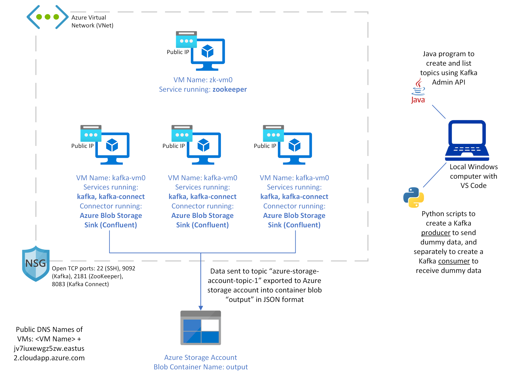

# Simple Kafka & Kafka Connect Deployment in Azure IaaS

This project deploys a simple Kafka cluster running Kafka and Kafka Connect in Azure. Three (3) VMs are deployed to run Kafka and Kafka Connect, while an additional VM is deployed to run ZooKeeper.

The three Azure VMs acting as Kafka brokers are additionally configured with a Kafka Connector: the [Azure Blob Storage Sink Connector for Confluent Platform](https://docs.confluent.io/kafka-connectors/azure-blob-storage-sink/current/overview.html). With this connector, data sent to the topic "azure-storage-account-topic-1" is exported to a blob container of an Azure storage account. 

This Azure storage account is deployed alongside the other Azure VMs through a [Bicep file](https://learn.microsoft.com/en-us/azure/azure-resource-manager/bicep/).

## Architecture

## License

[MIT](https://choosealicense.com/licenses/mit/)